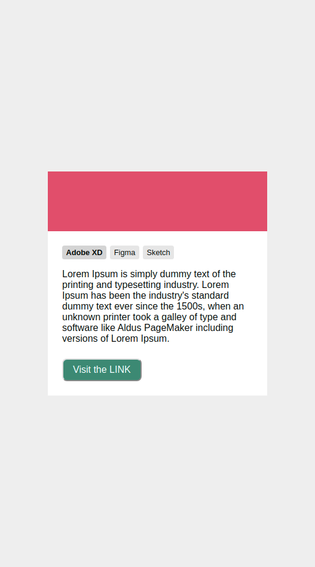

# CSS Modular com BEM

BEM é a sigla de **B**lock **E**lement **M**odifier que, em português, significa Bloco Elemento Modificador.

Forma estruturada de nomear classes, baseando-se nas propriedades de elemento em questão.

## Resultado final do Layout com BEM-CSS.

